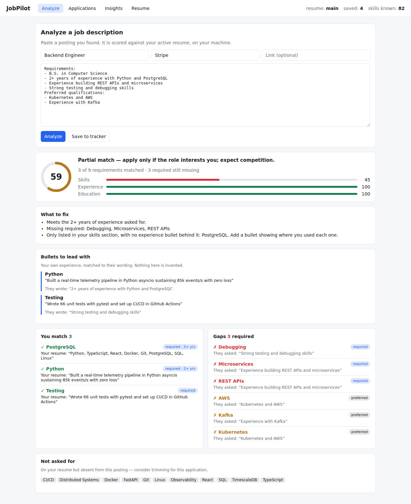
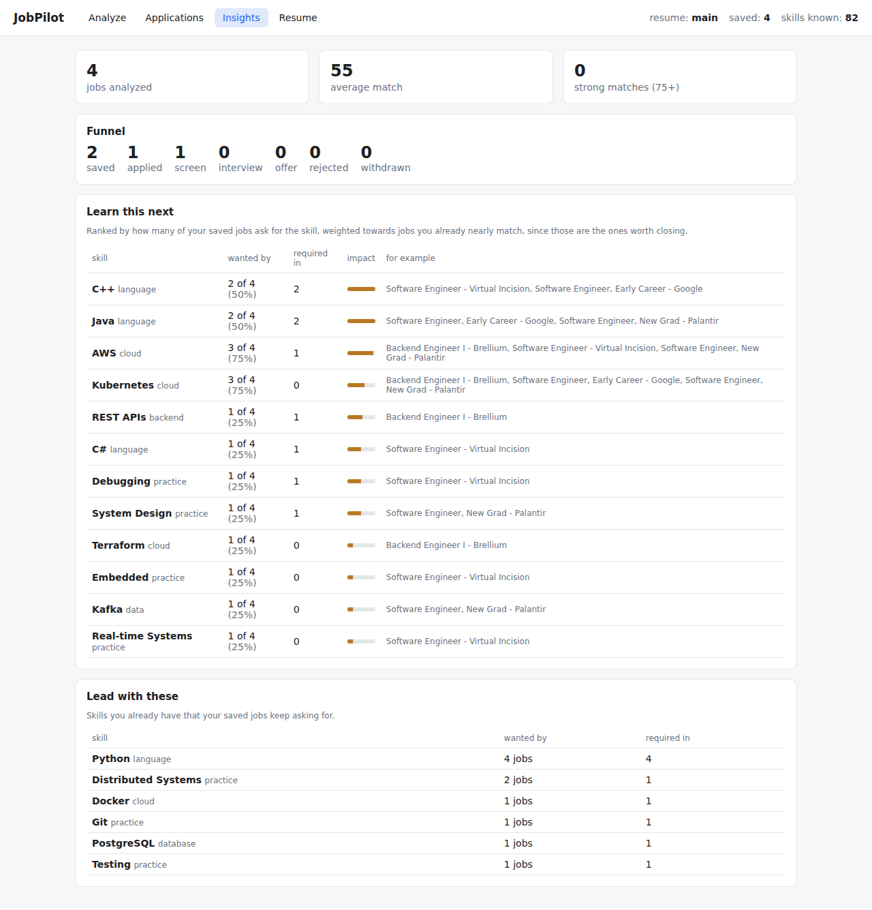

# JobPilot

Two tools in one repository:

1. **Match analyzer** (below) — paste a job description, see how your resume scores
   against it and exactly why, track your applications, and learn which missing skill
   would unlock the most of the jobs you actually want. Everything runs locally: one
   SQLite file, no scraping, no outbound calls.
2. **Legacy scraper and auto-apply** — earlier modules that scrape job boards and fill
   application forms. Not used by the analyzer, and not recommended: automated
   submission breaks most job boards' terms, and a logged-in scraping session puts the
   account you are job hunting with at risk. See [docs/LEGACY.md](docs/LEGACY.md).

---

# Match analyzer



## Quick start

```bash
python -m venv .venv && source .venv/bin/activate    # Windows: .venv\Scripts\activate
pip install -e ".[dev]"

# command line
jobpilot-match resume path/to/your_resume.pdf
jobpilot-match score path/to/job_description.txt
jobpilot-match save  path/to/job_description.txt -t "Backend Engineer" -c Stripe
jobpilot-match insights

# or the web UI
uvicorn jobpilot.api.server:app --port 8000     # http://localhost:8000
cd web && npm install && npm run dev            # http://localhost:5174 in development
```

## What it does

**Reads the posting like a screen does.** Requirements are pulled out one by one,
marked required or preferred, with the years asked for and the sentence they came
from. 82 skills are recognised through their aliases, so "K8s", "Kubernetes" and
"k8s" are one skill.

**Scores your resume, and shows its work.** Every matched skill carries the bullet
that proves it; every gap carries the sentence that asked for it. Three components —
skills, experience, education — so a missing year never looks like a missing skill.

**Tells you what to fix.** Skills listed only in your skills section with no
experience behind them. Skills the analyzer inferred rather than read, which a
keyword screen would miss. Skills on your resume this posting never asked for.

**Tracks applications** through saved → applied → screen → interview → outcome, with
every stage change recorded.

**Says what to learn next**, from your own saved jobs rather than from a blog post.



## Design notes

The interesting decisions, and the bugs real postings found, are in
[docs/MATCH_ANALYZER.md](docs/MATCH_ANALYZER.md).

## Layout

```
jobpilot/analyzer/   skills.py (taxonomy)  jd.py (posting → requirements)
                     resume.py (resume → bullets + evidence)  match.py (scoring)
                     gaps.py (across all saved jobs)  store.py (SQLite)  cli.py
jobpilot/api/        FastAPI: REST + serves the built dashboard
web/                 React + TypeScript (Vite)
tests/               72 tests
```

## Tests

```bash
pytest tests/test_analyzer.py tests/test_api.py -q
```

---

## Legacy modules

## Quick Start

```bash
# 1. Install
pip install -e ".[dev]"
playwright install chromium

# 2. Initialize config
jobpilot init
# Edit config/settings.yaml with your details

# 3. Import your LinkedIn profile
jobpilot profile "https://linkedin.com/in/your-profile"
# A browser window opens — log into LinkedIn if needed

# 4. Scan for matching jobs
jobpilot scan

# 5. Auto-apply to top matches
jobpilot apply --limit 5

# 6. Run continuous daemon
jobpilot daemon
```

## Commands

| Command | Description |
|---------|-------------|
| `jobpilot init` | Create config from template |
| `jobpilot profile <url>` | Scrape LinkedIn and store profile |
| `jobpilot today [LOCATION] [-n N]` | Scan, then list today's fresh entry-level jobs + save links to CSV |
| `jobpilot applied ID [ID ...]` | Mark jobs you applied to yourself (counts toward the daily target) |
| `jobpilot skip ID [ID ...]` | Hide jobs from the daily queue |
| `jobpilot scan` | Scan all job boards for matches |
| `jobpilot apply [--limit N]` | Auto-apply to top N matched jobs |
| `jobpilot resume [JD_TEXT] -t TITLE -c COMPANY` | Generate a resume for a specific job |
| `jobpilot tracker [STATUS]` | View application tracker |
| `jobpilot followups` | Show pending follow-ups + email drafts |
| `jobpilot report` | Weekly summary |
| `jobpilot daemon` | Continuous scanning + notifications |
| `jobpilot status` | Show current profile & stats |

## How It Works

1. **Profile Import** — Scrapes your LinkedIn profile via Playwright (uses your real browser session)
2. **Job Scanning** — Monitors Greenhouse, Lever, LinkedIn public search
3. **Matching** — Scores jobs against your skills/roles/level/salary/location
4. **Resume Generation** — Creates tailored `.docx` using `python-docx` (no AI text = no watermarks)
   - Mirrors exact JD keywords in your skills section
   - Prioritizes matching skills first
   - Every bullet starts with an action verb + metric
   - Single-column, ATS-parseable format
5. **Auto-Apply** — Fills Greenhouse/Lever/generic forms via Playwright
6. **Tracking** — SQLite database tracks all applications, follow-ups, statuses
7. **Notifications** — Telegram, email, or desktop alerts for new matches

## Daily New Grad / Entry-Level Workflow

```bash
jobpilot today india      # or: bangalore / usa / all
# open the links in output/daily/<date>_<location>.csv and apply
jobpilot applied 12 15 18 # track what you applied to (e.g. 12/50 today)
jobpilot skip 20          # not a fit, don't show again
```

Settings in `job_search` (config/settings.yaml):

- `max_applications_per_day` — daily target (50)
- `entry_level_only` — drop senior / staff / manager roles and roles asking for more than
  `max_years_experience` years (parsed from the job description when available)
- `new_grad_only` — only roles that say new grad / graduate / early career / entry level /
  recent graduates in the title or description (or come from the new grad list)
- `max_age_days` — only keep jobs posted in the last N days (LinkedIn uses its "past 24h" filter)
- `linkedin.experience_levels` — LinkedIn filter: 1=Internship, 2=Entry level, 3=Associate
- `greenhouse_companies` / `lever_companies` / `ashby_companies` — add more company boards by slug

### How jobs are matched to your resume

Each job gets a 0-100 score (`jobpilot/matching.py`); only jobs at or above
`job_search.match_threshold` (55) are shown:

- **Title (0-45):** matches one of `profile.job_titles` and/or contains one of your
  `profile.focus_keywords` (e.g. "ML", "AI", "backend"). Titles with any
  `job_search.exclude_title_keywords` (e.g. "java", "frontend", "analyst") score 0.
- **Skills (0-50):** your skills that the job description asks for. `profile.core_skills` count
  most. The rest come from your resume: `profile.resume_path` (.pdf/.docx/.txt) plus the
  tech stack, work history, projects and achievements in your config.
- **Level (-20 to +15):** entry level scores highest.

**Graduation year:** set `profile.graduation_date` (e.g. `"2025-05"`). Roles for other classes
("Class of 2026", "New Grad - December 2026", "2027 Start", "graduating between Dec 2025 and
Aug 2026", "currently enrolled") are hidden, and `today` shows whether each job is confirmed
open to your class (`✓ yes`), open to recent grads (`likely`), or doesn't say (`?`).

Job descriptions are fetched from Greenhouse, Lever, Ashby and LinkedIn, and for links on
aggregator lists that point to Workday, Greenhouse, Lever, Ashby or SmartRecruiters (up to
`job_search.linkedin.max_descriptions` / `job_search.max_descriptions` per scan), so skills can
be compared. Jobs without a description are scored on the title only and use the lower
`match_threshold_title_only`. `jobpilot today` shows which of your skills each job asks for.

## ATS Score > 90 Strategy

- Keywords extracted from JD and matched against your real skills
- Skills section reordered to front-load JD matches
- Standard section names (`PROFESSIONAL EXPERIENCE`, not creative headers)
- Single-column layout, Calibri font, no tables/graphics
- File naming: `FirstName_LastName_Role_Company.docx`

## No AI Watermarks

The resume generator uses **zero AI-generated text**. All content comes from:
- Your actual LinkedIn profile data
- Your config file achievements/skills
- Structural templates (action verbs, section headers)
- JD keyword integration into your existing content

## Config

Edit `config/settings.yaml`:
- Profile details (skills, target roles, salary, location)
- Job search parameters (match threshold, sources, blacklist)
- Notification settings (Telegram bot token, email SMTP)
- AI settings (only used if you want AI to rewrite bullets — optional)

## Job Sources

- **Greenhouse** — stripe, databricks, anthropic, openai, figma, notion, airbnb, coinbase, discord, plaid, ramp
- **Lever** — netflix
- **Ashby** — openai, notion, ramp, linear, perplexity, elevenlabs, cursor
- **LinkedIn** — public job search with Entry level / Associate + past-24h filters, paginated
- **SimplifyJobs New-Grad-Positions** — community new grad list (US/Canada/UK; `usa` and `all` scans)
- **Naukri, thejob.dev** — India (`india`, `bangalore` and `all` scans)

Add more companies by editing `GREENHOUSE_COMPANIES` / `LEVER_COMPANIES` in `jobpilot/scraper/jobs.py`.
